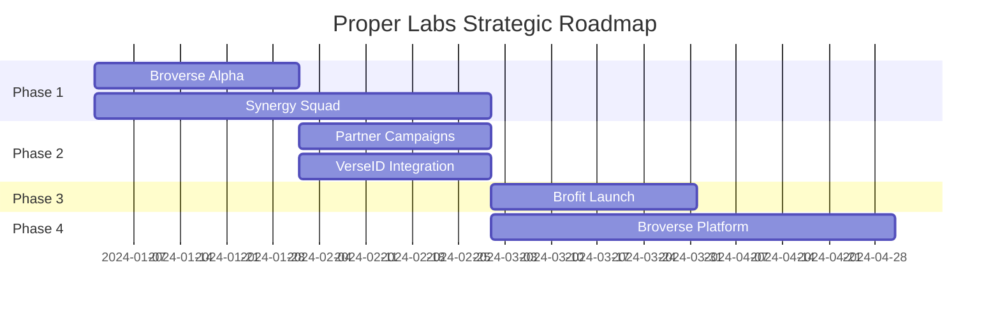

# Strategic Roadmap

> **90-day sprint to product-market fit, then scale to dominance**

## Execution Timeline

### 📅 Phase Overview

## Phase 1: Foundation (Month 1)

### 🚀 Broverse Alpha Hub on W3DV

:::info
**Objectives**
- Launch MVP on existing W3DV infrastructure
- Test core mechanics with alpha community
- Iterate based on user feedback
- Build initial traction metrics
:::

#### Key Deliverables
- [ ] Quest system live with 10 initial quests
- [ ] AI agent interactions (Bro, Lil Sis basics)
- [ ] Avatar generation feature
- [ ] BITS tracking system
- [ ] Basic leaderboard

#### Success Metrics
- 1,000 active users
- 50% 7-day retention
- 10,000 quest completions
- 100 avatars created

### 👥 Synergy Squad Formation

#### Community Building
- Recruit 100 founding members
- Establish Discord/Telegram presence
- Create ambassador program
- Launch referral incentives

#### Content Strategy
- Daily quest releases
- Weekly community calls
- Meme competitions
- Creator showcases

## Phase 2: Expansion (Month 2)

### 🎯 Partner Campaigns

:::success
**Partnership Goals**
- Onboard 5 launch partners
- Run first paid campaigns
- Prove CPVA model
- Generate initial revenue
:::

#### Target Partners
1. **Gaming Projects**: Web3 games seeking players
2. **DeFi Protocols**: Need verified users
3. **L2 Chains**: Growing ecosystem adoption
4. **NFT Collections**: Building communities
5. **Consumer Brands**: Testing Web3 waters

#### Campaign Types
- User acquisition (sign-ups)
- Product trials (gameplay, DeFi usage)
- Social amplification (content creation)
- Feedback collection (surveys, testing)

### 🆔 VerseID Integration

#### Technical Implementation
- [ ] Unified identity system
- [ ] BEATS recognition engine
- [ ] Tier progression logic
- [ ] Vibe Oracle v1
- [ ] Cross-platform sync

#### User Experience
- Seamless onboarding
- Visual identity dashboard
- Achievement system
- Reputation display
- Social verification

## Phase 3: Monetization (Month 3)

### 💰 Brofit Launch

:::warning
**Launch Requirements**
- $1M initial TVL target
- 3 vault strategies ready
- Security audits complete
- Insurance coverage active
:::

#### Vault Strategies
1. **Stable Vault**: USDC/USDT conservative yield
2. **ETH Vault**: Staking and liquid staking
3. **BRO Vault**: Native token staking

#### Integration Points
- VerseID reputation multipliers
- Automated reward distribution
- Dashboard and analytics
- Withdrawal mechanisms

### Marketing Campaign
- Influencer partnerships
- Yield comparisons
- Security messaging
- Early bird bonuses

## Phase 4: Platform Launch (Month 3-4)

### 🌐 Broverse Standalone Platform

#### Product Features
- [ ] Full quest marketplace
- [ ] Advanced AI agents
- [ ] Creator tools suite
- [ ] Social features
- [ ] Mobile responsive

#### Technical Requirements
- Scalable infrastructure
- Real-time data processing
- API for partners
- Analytics dashboard
- Admin tools

#### Go-to-Market
- Public launch event
- Press coverage
- Community celebration
- Partner announcements

## Key Milestones & KPIs

### 30-Day Targets
| Metric | Target | Stretch Goal |
|--------|--------|--------------|
| **Users** | 1,000 | 2,500 |
| **Quests Completed** | 10,000 | 25,000 |
| **Partner Campaigns** | 2 | 5 |
| **Revenue** | $10K | $25K |

### 60-Day Targets
| Metric | Target | Stretch Goal |
|--------|--------|--------------|
| **Users** | 5,000 | 10,000 |
| **VerseIDs Created** | 2,500 | 5,000 |
| **Campaign Revenue** | $50K | $100K |
| **Community Size** | 10K | 20K |

### 90-Day Targets
| Metric | Target | Stretch Goal |
|--------|--------|--------------|
| **Users** | 10,000 | 25,000 |
| **Brofit TVL** | $1M | $5M |
| **Total Revenue** | $200K | $500K |
| **$BRO Holders** | 1,000 | 2,500 |

## Resource Requirements

### Team Expansion

:::tabs
::tab{label="Immediate Hires"}
### Priority Roles (Month 1)
- **Backend Developer**: Quest/identity systems
- **Frontend Developer**: UI/UX implementation
- **Community Manager**: Discord/social management
- **QA/Testing**: Bug hunting and feedback
::
::tab{label="Growth Hires"}
### Scaling Roles (Month 2-3)
- **DevOps Engineer**: Infrastructure scaling
- **Data Analyst**: Metrics and insights
- **Business Development**: Partnership growth
- **Content Creator**: Marketing materials
::
:::

### Budget Allocation

| Category | Monthly | 3-Month Total |
|----------|---------|---------------|
| **Development** | $50K | $150K |
| **Marketing** | $30K | $90K |
| **Operations** | $20K | $60K |
| **Community** | $10K | $30K |
| **Infrastructure** | $10K | $30K |
| **Legal/Compliance** | $5K | $15K |
| **Contingency** | $10K | $30K |
| **Total** | **$135K** | **$405K** |

## Risk Mitigation

### Technical Risks
- **Mitigation**: Gradual rollout, extensive testing
- **Backup**: Fallback to W3DV infrastructure

### Market Risks
- **Mitigation**: Multiple revenue streams
- **Backup**: Pivot to B2B focus if needed

### Regulatory Risks
- **Mitigation**: Legal review, compliant structure
- **Backup**: Jurisdiction flexibility

### Competition Risks
- **Mitigation**: Fast execution, unique features
- **Backup**: Partnership/acquisition talks

## Success Criteria

:::success
**Definition of Success**

By Day 90, Proper Labs will have:
1. ✅ 10,000+ verified users
2. ✅ $200K+ in revenue
3. ✅ $1M+ Brofit TVL
4. ✅ 5+ enterprise partnerships
5. ✅ Clear path to $1M MRR
:::

## Beyond 90 Days

### Q2 2024: Scale
- 100K users
- $10M TVL
- $500K MRR
- Series A fundraise

### Q3 2024: Expand
- International markets
- SIS platform launch
- Token public sale
- 500K users

### Q4 2024: Dominate
- Market leader position
- $100M TVL
- $2M MRR
- Acquisition offers

> **The next 90 days determine the next 90 months. Execute with precision.**