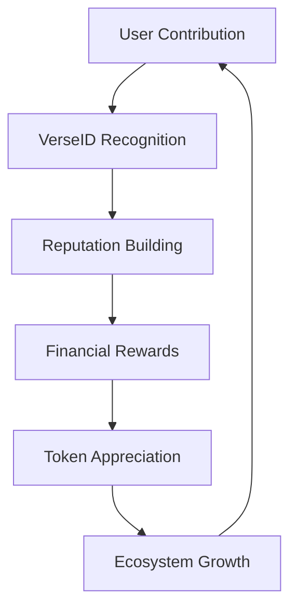

# How It All Ties Together

> **The Proper Labs ecosystem is a closed value loop where every action strengthens the whole system**

## The Universal Value Flow

## Step-by-Step Value Creation

### 1️⃣ Users Contribute in Broverse
- Participate in quests and challenges
- Create and remix content
- Engage with AI agents
- Build community connections

### 2️⃣ VerseID Recognizes Actions
- **BITS**: Track quantity of participation
- **BEATS**: Measure quality and impact
- **Tiers**: Progress through reputation levels
- **Verification**: Proof-of-humanity validation

### 3️⃣ Brofit Distributes Value
- Base yields on deposited assets
- Reputation-based multipliers
- Bonus APY in $BRO tokens
- Compound growth opportunities

### 4️⃣ $BRO Unifies Everything
- Single token across all products
- Multiple utility functions
- Value concentration mechanism
- Network effect amplifier

### 5️⃣ SIS Orchestrates Intelligence
- Agents learn from user behavior
- Convert activity into insights
- Generate benchmarks and datasets
- Optimize user experiences

### 6️⃣ Partners Scale Growth
- Claimr brings 7M+ users
- W3DV runs acquisition funnels
- Campaigns drive new participation
- B2B deals expand reach

## The Flywheel Effect

:::success
**Exponential Growth Through Network Effects**

Each component doesn't just add value — it multiplies it:
- More users → Better data → Smarter AI → Better UX → More users
- Higher reputation → More yield → More staking → Token appreciation → Higher rewards
- Better content → More engagement → Stronger culture → More creators → Better content
:::

## Value Multiplication Examples

### User Journey Example
1. **Sarah joins Broverse** through a Claimr campaign
2. **Completes quests** earning 1,000 BITS
3. **Creates viral meme** earning 100 BEATS
4. **Stakes in Brofit** with 1.5x reputation multiplier
5. **Earns enhanced yield** in both USDC and $BRO
6. **Reputation grows** unlocking new opportunities
7. **Becomes community leader** attracting more users

### Partner Integration Example
1. **Nike launches campaign** via Proper Labs
2. **Targets verified users** through VerseID
3. **Pays CPVA rates** (cost-per-verified-action)
4. **Gets clean data** without bots
5. **Achieves 10x better ROI** than traditional platforms
6. **Increases budget** and brings more brands

### Data Value Example
1. **Users generate actions** across ecosystem
2. **SIS processes behavior** into structured data
3. **Benchmarks created** from aggregate patterns
4. **Sold to enterprises** for market intelligence
5. **Revenue flows** to treasury and users
6. **Ecosystem strengthened** by revenue sharing

## Synergy Metrics

| Component | Standalone Value | Ecosystem Value | Multiplier |
|-----------|------------------|-----------------|------------|
| **Broverse** | $10M | $50M | 5x |
| **VerseID** | $5M | $30M | 6x |
| **Brofit** | $15M | $60M | 4x |
| **SIS** | $5M | $25M | 5x |
| **Total** | $35M | $165M | **4.7x** |

## Competitive Moats

### 🏰 Network Effects
- Each user makes the platform more valuable
- Each partner brings more users
- Each dataset improves AI quality
- Each improvement attracts more users

### 🔒 Switching Costs
- Reputation can't be transferred
- Social connections are embedded
- Financial stakes are locked
- Identity becomes essential

### 📊 Data Advantages
- Proprietary user behavior data
- Verified human interactions
- Cultural trend insights
- Performance benchmarks

### 🤝 Partner Lock-in
- Integrated campaigns
- Shared user bases
- Revenue dependencies
- Technical integrations

## Success Indicators

:::info
**Key Performance Indicators**

The ecosystem health is measured by:
- **Cross-Product Usage**: Users active in 2+ products
- **Retention Rates**: 30-day, 90-day, yearly
- **Value Per User**: Total ecosystem revenue/user
- **Network Growth**: User-to-user referral rate
- **Token Velocity**: $BRO circulation and utility
:::

## Risk Mitigation

### Dependency Risks
- No single point of failure
- Multiple revenue streams
- Diversified user acquisition
- Redundant infrastructure

### Market Risks
- Bear market resilience through real yield
- Multiple market segments (DeFi, Gaming, AI)
- B2B revenue hedges B2C volatility
- Geographical diversification

## The Ultimate Vision

> **Proper Labs creates a self-sustaining digital economy where:**
> - Culture generates identity
> - Identity drives reputation
> - Reputation unlocks value
> - Value strengthens culture
>
> **This isn't just a product suite — it's a new economic paradigm.**