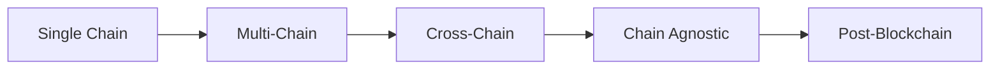

# Long-Term Vision

> **Building a new digital economy where reputation, behavior, and identity fuel both community engagement and enterprise value**

## The 10-Year Vision

### 🌍 A New Internet Layer

Proper Labs envisions becoming the **identity and reputation layer of the internet** — where every digital interaction contributes to a portable, valuable identity that users truly own.

:::info
**The Future We're Building**

Imagine a world where:
- Your online reputation has real financial value
- AI agents understand and amplify human culture
- Communities self-organize around shared values
- Every contribution is recognized and rewarded
- Identity transcends platforms and chains
:::

## Strategic Pillars

### 1️⃣ Cultural Infrastructure

**Becoming the MySQL of Web3 Culture**

Just as MySQL became the default database, VerseID will become the default identity layer for Web3 applications. Every dApp, game, and platform will integrate VerseID for user verification and reputation.

#### Key Milestones
- ✅ 2024: Launch core identity system
- 🎯 2025: 100+ partner integrations
- 🎯 2026: Industry standard adoption
- 🎯 2027: 1 billion identity interactions

### 2️⃣ Data as a Monetizable Asset

**The Bloomberg of Behavioral Data**

Every verified user action in our ecosystem becomes structured data — creating the most valuable repository of authentic human behavior in Web3.

#### Revenue Streams
- **Performance Benchmarks**: How much does it really cost to acquire a Web3 user?
- **Behavioral Insights**: What makes users stick vs. churn?
- **Trend Prediction**: What's the next big thing in crypto culture?
- **AI Training Data**: Verified human interactions for model improvement

#### Market Opportunity
| Data Type | Market Size | Our Share (5yr) |
|-----------|-------------|-----------------|
| **Web3 Analytics** | $5B | 10% = $500M |
| **AI Training Data** | $50B | 1% = $500M |
| **Enterprise Intelligence** | $20B | 2% = $400M |

### 3️⃣ AI-Powered Experiences

**The Pixar of AI Agents**

SIS evolves from infrastructure to a platform where anyone can create, deploy, and monetize AI agents that understand culture, identity, and human needs.

#### Product Evolution
1. **Internal Agents** (Current): Bro, Lil Sis, Big Sis, CBO
2. **Platform Agents** (2025): User-created agents
3. **Agent Marketplace** (2026): Buy, sell, trade agents
4. **Agent Network** (2027): Autonomous agent economy

### 4️⃣ Financial Revolution

**The Vanguard of DeFi**

Brofit becomes the gateway for mainstream users to access DeFi yields, using reputation as collateral and culture as the user interface.

#### Scale Targets
| Metric | 2024 | 2025 | 2026 | 2027 |
|--------|------|------|------|------|
| **TVL** | $10M | $100M | $1B | $10B |
| **Users** | 1K | 10K | 100K | 1M |
| **Avg Yield** | 15% | 20% | 25% | 30% |

## Expansion Strategy

### Geographic Expansion

:::tabs
::tab{label="Phase 1: English Markets"}
### 2024-2025
- United States
- United Kingdom
- Canada
- Australia
- Singapore
::
::tab{label="Phase 2: Global Growth"}
### 2025-2026
- Europe (EU)
- Latin America
- Southeast Asia
- Middle East
- India
::
::tab{label="Phase 3: Full Coverage"}
### 2026-2027
- China (via partners)
- Japan & Korea
- Africa
- Eastern Europe
- Rest of World
::
:::

### Vertical Expansion

#### Gaming
- Identity for game characters
- Cross-game reputation
- Achievement portability
- Guild management tools

#### Social Media
- Verified creator scores
- Content monetization
- Influence metrics
- Anti-bot verification

#### E-commerce
- Trust scores for sellers
- Review authenticity
- Payment reputation
- Dispute resolution

#### Education
- Skill verification
- Course completion NFTs
- Peer credentials
- Knowledge graphs

## Technology Roadmap

### Blockchain Evolution

### AI Development

| Phase | Capability | Timeline |
|-------|------------|----------|
| **Current** | Reactive agents | Now |
| **Next** | Predictive agents | 6 months |
| **Future** | Autonomous agents | 18 months |
| **Vision** | AGI integration | 3+ years |

## Competitive Positioning

### Becoming Uncopyable

:::success
**Our Moats in 5 Years**

1. **Network Effects**: 10M+ users making platform indispensable
2. **Data Advantage**: 1B+ verified interactions impossible to replicate
3. **Cultural Lock-in**: "Proper Labs native" becomes identity badge
4. **Technical Complexity**: 5-year head start on AI+blockchain integration
5. **Regulatory Compliance**: First-mover advantage in multiple jurisdictions
:::

## Impact Metrics

### Changing the World

| Impact Area | 5-Year Goal | Measurement |
|-------------|-------------|-------------|
| **Financial Inclusion** | 1M unbanked users | Access to yield via Brofit |
| **Creator Empowerment** | $100M to creators | Direct monetization |
| **Bot Elimination** | 99% reduction | Verified human interactions |
| **Cultural Preservation** | 10M memes archived | Permanent cultural record |
| **AI Advancement** | 10x better models | Quality training data |

## Exit Scenarios

### Potential Outcomes

#### IPO Path (5-7 years)
- $10B valuation target
- NYSE or NASDAQ listing
- Maintain crypto operations
- Dual token-equity structure

#### Strategic Acquisition (3-5 years)
- Buyers: Meta, Google, Microsoft, Coinbase
- Valuation: $1-5B
- Integration into larger ecosystem
- Team retention critical

#### DAO Transformation (Ongoing)
- Progressive decentralization
- Community ownership
- Token-based governance
- Proper Labs as service provider

#### Perpetual Innovation (Preferred)
- Stay private and independent
- Continuous reinvention
- Category creation
- Generational company

## The Ultimate Endgame

> **Proper Labs becomes the foundational layer for digital identity in the post-blockchain era**

### What Success Looks Like

In 2034, Proper Labs has:

✅ **1 billion users** with verified identities
✅ **$1 trillion** in cumulative value transferred
✅ **Standard protocol** status like HTTP or TCP/IP
✅ **Cultural impact** defining a generation
✅ **Financial inclusion** for millions globally
✅ **AI advancement** through ethical data practices
✅ **Decentralized ownership** with community governance

## Call to Action

### Join the Revolution

:::warning
**The Next Decade Starts Now**

We're not just building products — we're architecting the future of human-digital interaction. This is your invitation to:

1. **Invest** in the vision (equity or tokens)
2. **Build** the technology (join the team)
3. **Participate** in the ecosystem (become a user)
4. **Spread** the culture (be an ambassador)
5. **Shape** the future (provide input)

**The question isn't whether this future will exist — it's whether you'll help create it.**
:::

> **Proper Labs: Where Identity Meets Intelligence Meets Infinity**

*Building the future, one vibe at a time.* 🚀